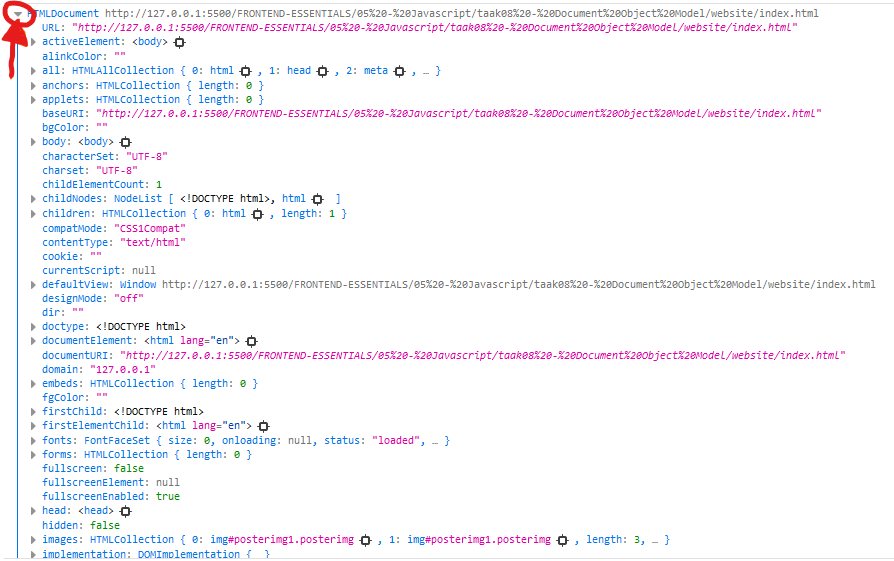
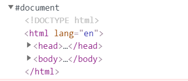
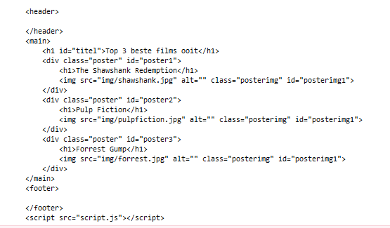

# FRONTEND-ESSENTIALS

## Javascript

## taak08 - Document Object Model

### Introductie

Je bent al heel ver gekomen. Je weet nu wat `HTML` is en je kunt dus structuur aanbrengen op een website. Je weet dat je diezelfde structuur kunt stijlen met `CSS`. En je weet dat je met `Javascript` kunt rekenen en variabelen kunt vullen. Maar hoe combineer je dit alles tot `FRONTEND DEVELOPMENT`

Stel je hebt de film website die je bij DevOps hebt aangepast.

Die gehele film HTML pagina is van het datatype Object. Elke HTML-document is een Document Object Model (DOM).

Zodra een HTML document is ingeladen in de browser dan wordt het een Document Object. Dit document heeft net als het andere Object properties (eigenschappen)

Omdat dit zo is kunnen we dit in Javascript bekijken en veranderen.

De code die hieronder wordt besproken kun je __zelf uit testen__ in `script.js`

> Open dus index.html in je browser.

Als je het object wilt bekijken dan kun je dat in de console doen:

```js
console.log(document);
```

Als je Firefox gebruikt: druk nog even op het pijltje zodat je alle eigenschappen kunt zien


Dat zijn veel eigenschappen hè.

Gebruik je Google Chrome dan zie je dit:



Alle HTML-tags!

We kunnen ook nog andere dingen bekijken. Bijvoorbeeld de titel van het html document uitlezen:

```js
console.log(document.title);
```


Maar uitlezen is saai. We kunnen het ook veranderen. Net als bij het Object persoon bij taak03.

```js
document.title = "Dit zijn drie films";
```


Maar we kunnen nog verder het document bekijken:

```js
console.log(document.body.innerHTML);
```



Alle HTML tags die in de `<body>`-tag staan

Maar we kunnen ook dingen veranderen:

```js
document.body.innerHTML = "<h1>alles is gewist</h1>";
```

Alles is gewist??!! Ja je hebt de HTML van de body verwijderd.

Je kunt ook specifieke elementen beinvloeden, en zeker als ze een `id` hebben. Net als bij CSS.

Je kunt bijvoorbeeld een afbeelding dynamisch aanpassen met Javascript.

```js
document.querySelector("#posterimg1").src = "";
```

And the poster is gone...!

Check de website eens. En haal het commentaar weg op regel 6 van `script.js`. Wat gebeurt er?

Niet heel spannend he. Maar je hebt wel de DOM aangepast met Javascript. Welkom bij Frontend Development!

Ok, Nog eentje. Haal het commentaar op regel 35 weg van `index.html`. En klik eens op een van de posters. Nu wordt al iets interessanter hè.

### Opdracht

1. Maak gebruik van index.html en script.js
2. Zonder aan de CSS te komen, verander van elke poster eens de achtergrond kleur met behulp van de code die op regel 9 van script.js staat. Maak ook gebruik van de bronnen hieronder.

### Bronnen

- [Two ways to set an element's CSS with vanilla JavaScript](https://gomakethings.com/two-ways-to-set-an-elements-css-with-vanilla-javascript/)
- [Document Object Model](https://www.javatpoint.com/document-object-model)
  